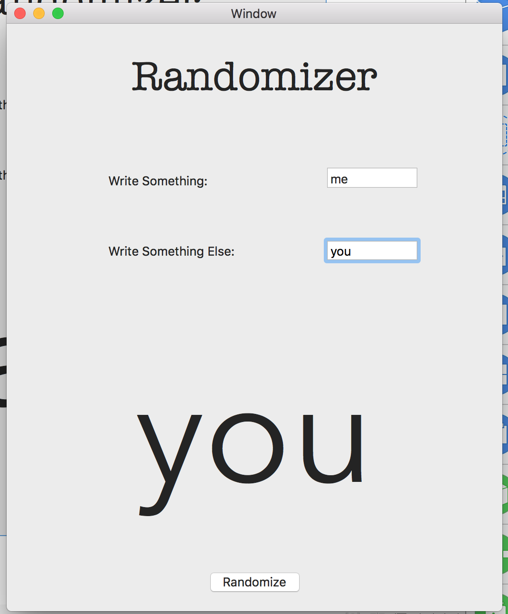

# Randomizer
Randomizer is an app that takes two inputs, and it selects randomly one of them, and it puts in a label.
If you are a beginner, with this project you will learn the basics of macOS Swift Programming (very difficult because there aren't many sources for macOS Development on the web.)

## This is a beta release.

### Please if you find bugs, report them.

